# Task API

A simple in-memory CRUD API built with Node.js and Express. The API allows tasks to be created, retrieved, updated, and deleted. Task data is stored in memory, so changes are reset when the server restarts.

Swagger UI is included to provide interactive API documentation and testing.

## Installation and Setup

Clone the repository:

```bash
git clone https://github.com/selmakarasoftic/FLyRankBackend.git
```

Navigate to the A1 directory:

```bash
cd FLyRankBackend/A1
```

Install the required dependencies:

```bash
npm install
```

Start the server:

```bash
npm start
```

The API will run at:

`http://localhost:3000`

Swagger UI is available at:

`http://localhost:3000/docs`

## API Endpoints

| Method | Endpoint | Description | Success Status |
|--------|----------|-------------|----------------|
| GET | `/` | Get basic API information | `200 OK` |
| GET | `/health` | Check if the server is running | `200 OK` |
| GET | `/tasks` | Get all tasks with optional filtering and search | `200 OK` |
| GET | `/tasks/:id` | Get a task by ID | `200 OK` |
| POST | `/tasks` | Create a new task | `201 Created` |
| PUT | `/tasks/:id` | Update a task | `200 OK` |
| DELETE | `/tasks/:id` | Delete a task | `204 No Content` |
| GET | `/stats` | Get task statistics | `200 OK` |
| POST | `/reset` | Reset tasks to the initial list | `200 OK` |

## Example Request with curl

The API can also be tested from the terminal using curl.

Example:

```bash
curl -i http://localhost:3000/health
```

Example response:

```text
HTTP/1.1 200 OK
X-Powered-By: Express
Content-Type: application/json; charset=utf-8
Content-Length: 15
ETag: W/"f-VaSQ4oDUiZblZNAEkkN+sX+q3Sg"
Date: Wed, 19 Aug 2026 22:38:01 GMT
Connection: keep-alive
Keep-Alive: timeout=5

{"status":"ok"}
```

## Swagger UI

The API documentation is defined in `openapi.json` and served using `swagger-ui-express`.

The Swagger UI provides access to the task CRUD endpoints:

- `GET /tasks` - Get all tasks
- `POST /tasks` - Create a new task
- `GET /tasks/{id}` - Get a task by ID
- `PUT /tasks/{id}` - Update a task
- `DELETE /tasks/{id}` - Delete a task
The optional `/stats` and `/reset` endpoints, as well as filtering and search parameters, are also documented in Swagger UI.

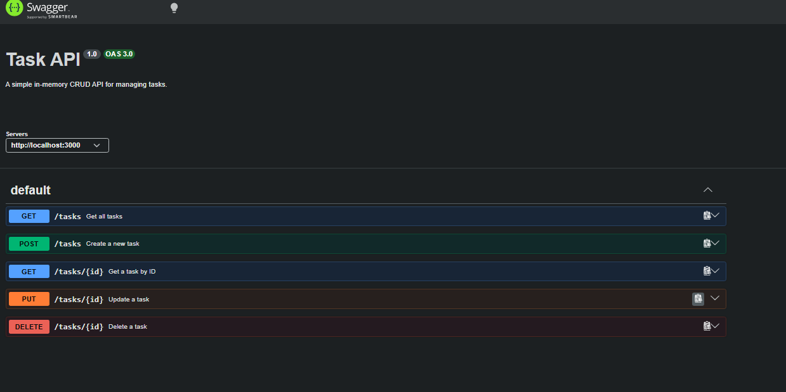

## API Testing with Swagger UI

The CRUD operations were tested directly through Swagger UI using the **Try it out** functionality.

### Get All Tasks

`GET /tasks` returns the current list of tasks with status `200 OK`.

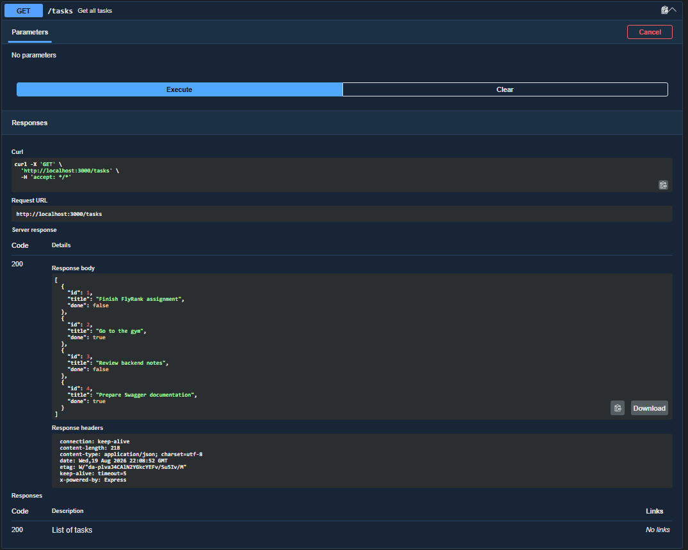

### Get Task by ID

`GET /tasks/{id}` returns a specific task when a valid ID is provided.

A successful request returns `200 OK`.

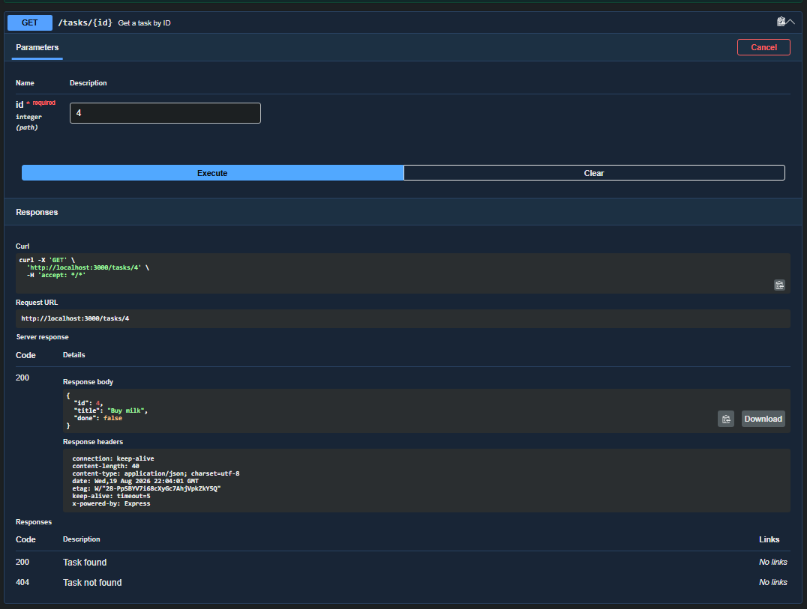

If the requested task does not exist, the API returns `404 Not Found`.

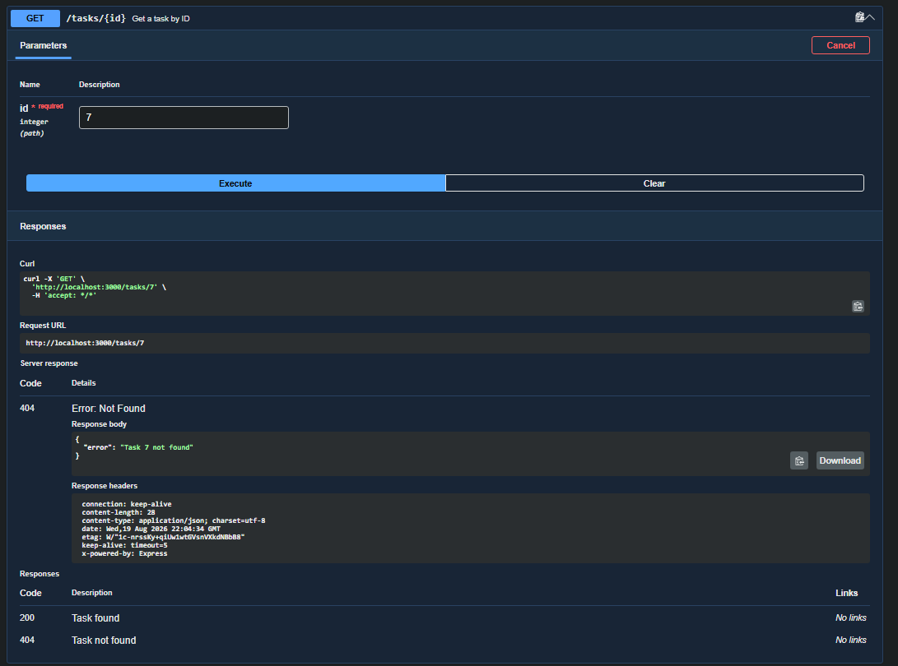

### Create a Task

`POST /tasks` creates a new task. The server assigns the next available ID and sets `done` to `false`.

A valid request returns `201 Created`.

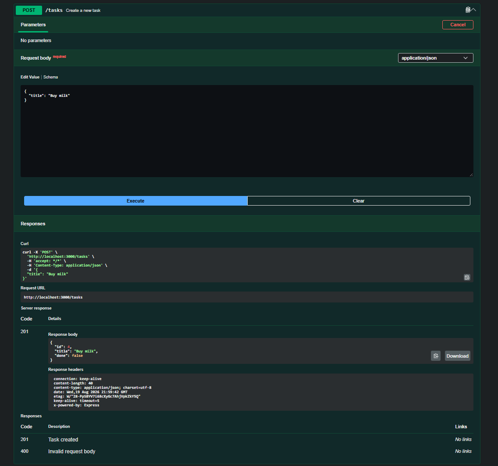

If the title is missing or empty, the API returns `400 Bad Request`.

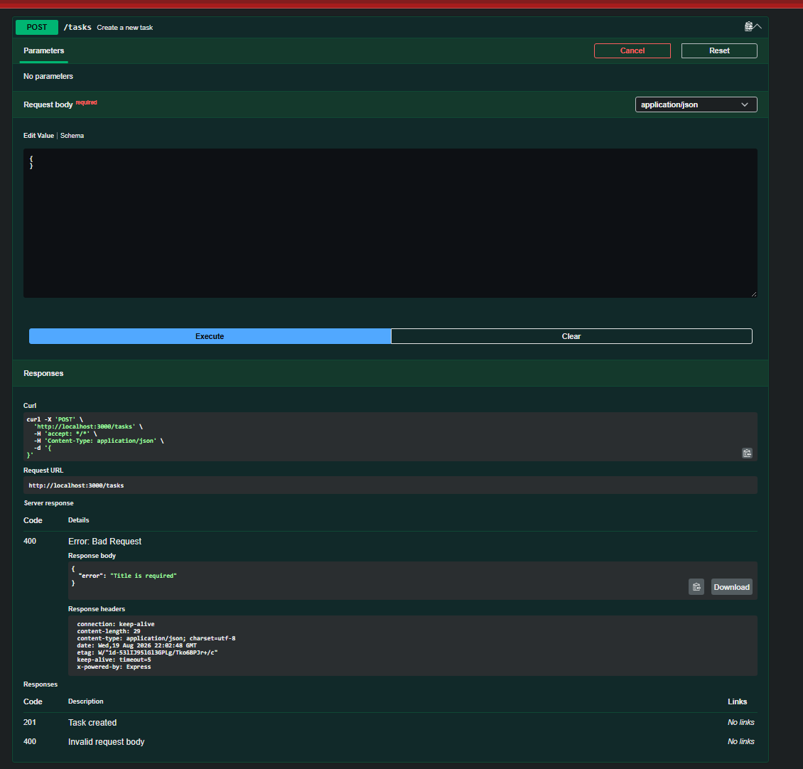

### Update a Task

`PUT /tasks/{id}` can update the task title, completion status, or both.

A successful update returns `200 OK`.

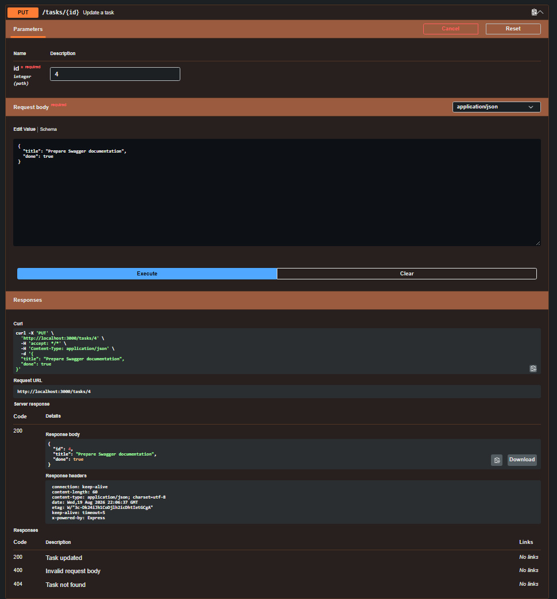

An empty or invalid request body returns `400 Bad Request`.

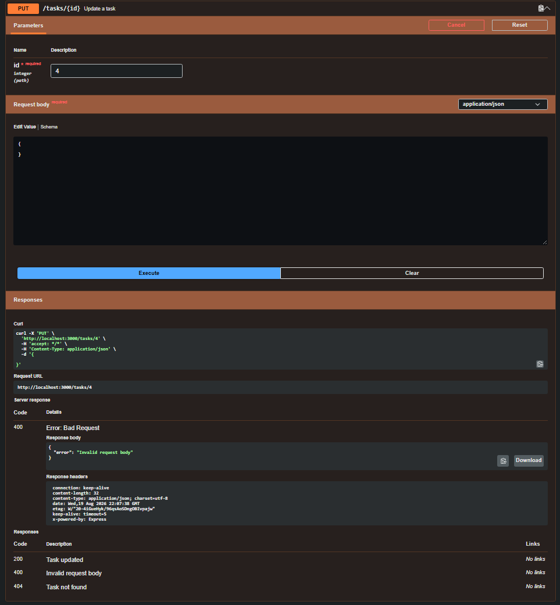

If the requested task does not exist, the API returns `404 Not Found`.

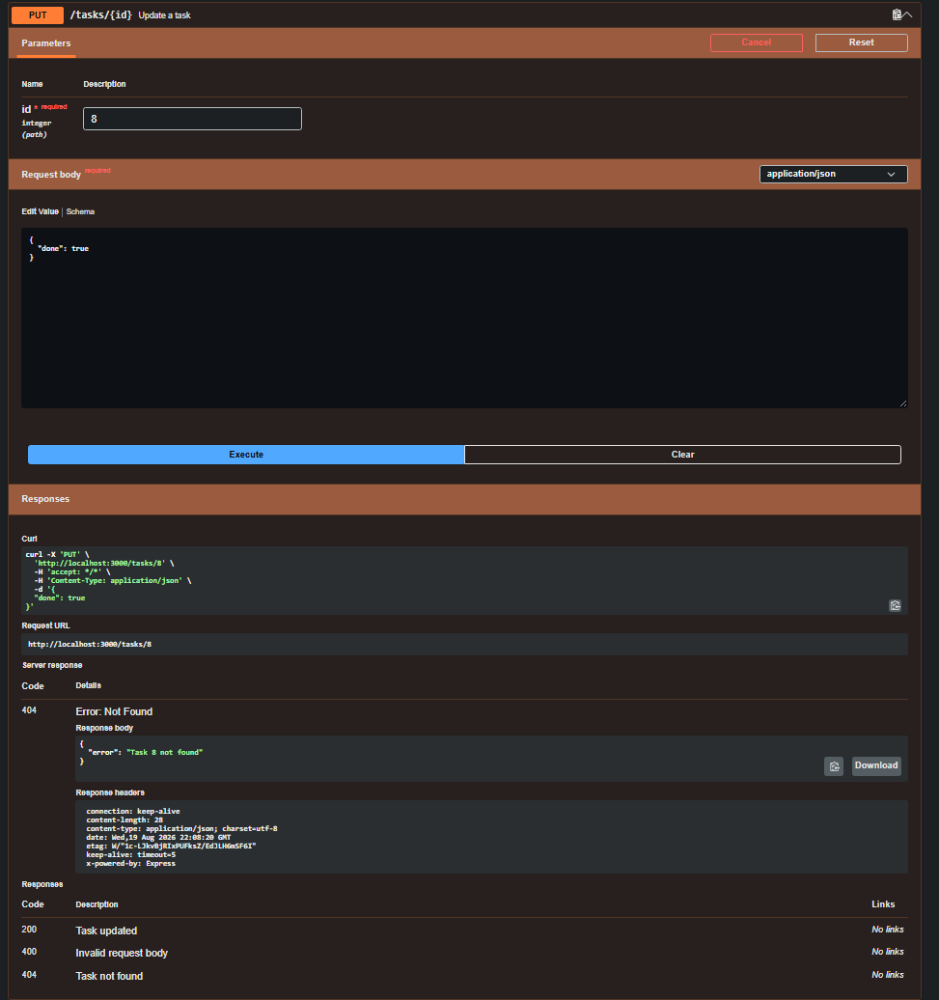

### Delete a Task

`DELETE /tasks/{id}` removes an existing task.

A successful deletion returns `204 No Content`.

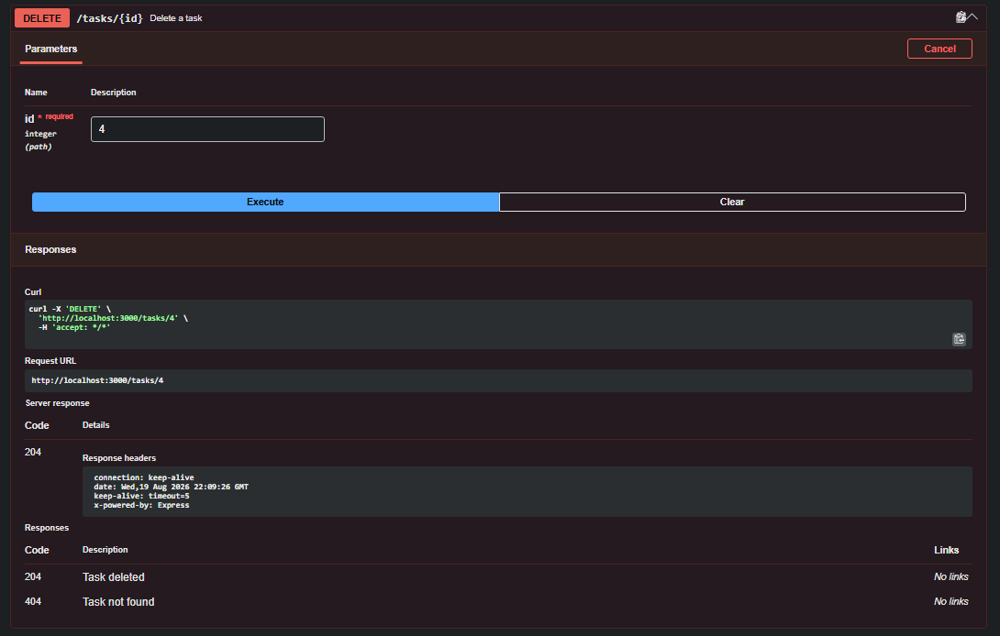

If the requested task does not exist, the API returns `404 Not Found`.

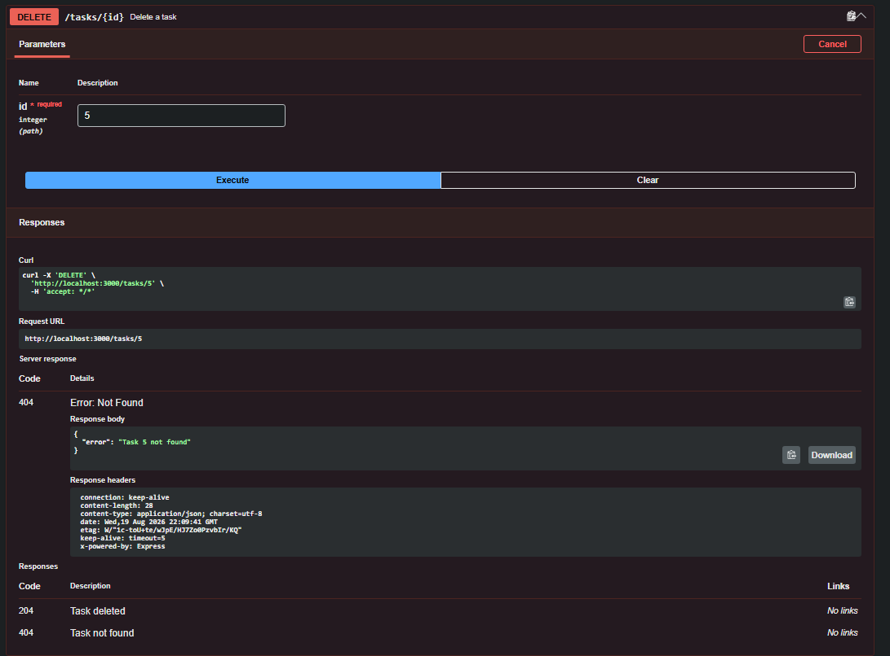

## Full CRUD Cycle

The complete CRUD cycle was tested successfully using Swagger UI:

1. Create a task using `POST /tasks`
2. List tasks using `GET /tasks`
3. Retrieve a task using `GET /tasks/{id}`
4. Update a task using `PUT /tasks/{id}`
5. Delete a task using `DELETE /tasks/{id}`

The API also correctly handles invalid request bodies and requests for tasks that do not exist.

## Optional Extras

The API also includes several optional in-memory features:

- `GET /tasks?done=true` filters tasks by completion status.
- `GET /tasks?search=word` searches for tasks by title.
- `GET /stats` returns the total, completed, and open task counts.
- `POST /reset` restores the original three example tasks.

These optional features are also documented in Swagger UI.

## In-Memory Storage

Tasks are stored in an in-memory JavaScript array rather than a database.

This means that tasks created, updated, or deleted while the server is running are not permanently stored. Restarting the server restores the initial task list.

## AI vs Me

### What did the AI do better?

The AI version used more detailed input validation and error messages. For example, when creating a task, it checked not only whether the title was empty, but also whether the title was actually a string. It also returned more specific validation messages when updating a task, such as explaining that `title` must be a non-empty string or that `done` must be a boolean.

I understand this approach and think it makes the API easier to use because the client receives more information about what was wrong with the request.

### What did the AI get wrong or ignore?

The main CRUD functionality worked correctly in my tests. The expected `200`, `201`, `204`, `400`, and `404` status codes all worked, so I did not find a major functional error in the AI-generated version.

However, there were some differences from my implementation. For example, my API returns an error such as `Task 99 not found`, while the AI version only returns `Task not found`. My version gives more information about which requested task could not be found.

The AI also changed some response details. For example, my `/health` endpoint returns only `{ "status": "ok" }`, while the AI added an additional `message` field.

### What did my prompt forget to specify?

My prompt did not specify the exact error message format, so the AI decided how detailed the error responses should be. It also did not specify the exact response for the `/health` endpoint, which allowed the AI to add its own `message` field.

I also did not ask the AI to implement the optional features I later added to my own version, such as filtering by `done`, searching by title, `/stats`, and `/reset`. Because these were not included in my prompt, the AI correctly left them out.

Another detail I did not specify was exactly how new task IDs should be generated. My implementation calculates the next ID from the existing tasks, while the AI created a `nextId` variable and increments it whenever a new task is created.

### My Original Prompt

```text
I want you to build a small Task CRUD API using JavaScript, Node.js and Express.
The API should store tasks only in memory using a JavaScript array. Do not use a database or file storage.
Each task should have:
- id: number
- title: string
- done: boolean
Start with three example tasks.
Implement these endpoints:
GET /
Return basic information about the API.
GET /health
Return a JSON response showing that the server is running.
GET /tasks
Return all tasks.
GET /tasks/:id
Return one task by its ID.
If the task does not exist, return status 404 with a JSON error message.
POST /tasks
Accept JSON containing a title.
Create a task with the next available ID and set done to false.
Return status 201 with the created task.
If the title is missing or empty, return status 400 with a JSON error message.
PUT /tasks/:id
Allow updating the title, done status, or both.
Return the updated task with status 200.
Return 404 if the task does not exist.
Return 400 if the request body is empty or invalid.
DELETE /tasks/:id
Delete the requested task.
Return status 204 with no response body when successful.
Return 404 if the task does not exist.
Run the server on localhost port 3000.
Also add Swagger UI using swagger-ui-express and an OpenAPI file. Swagger UI should be available at /docs and should document the five task CRUD endpoints.
Keep the implementation simple and beginner-friendly. Please provide all files needed to install and run the project.
```

### Improved Prompt

```text
Build a small Task CRUD API using JavaScript, Node.js, and Express.

Use only in-memory storage with a JavaScript array. Do not use a database, file storage, ORM, or any other persistence mechanism.

Each task must contain an id as a number, a title as a string, and done as a boolean.

Start with exactly three example tasks. Run the server on localhost port 3000.

Implement GET /. It must return exactly {"name":"Task API","version":"1.0","endpoints":["/tasks"]}.

Implement GET /health. It must return exactly {"status":"ok"}.

Implement GET /tasks. It must return the complete task list with status 200.

Implement GET /tasks/:id. It must return the requested task with status 200. If the task does not exist, return status 404 and include the requested ID in the error message, for example {"error":"Task 99 not found"}.

Implement POST /tasks. It must accept a JSON request body containing title. The title must be a non-empty string. The new task must receive the next available ID based on the existing tasks and done must be set to false. Return the created task with status 201. If the title is missing, empty, or not a string, return status 400 with a JSON error message.

Implement PUT /tasks/:id. It must allow updating title, done, or both. An empty request body must return status 400. If title is provided, it must be a non-empty string. If done is provided, it must be a boolean. An unknown task ID must return status 404 and the error message must include the requested ID. A successful update must return the updated task with status 200.

Implement DELETE /tasks/:id. It must delete the requested task. A successful deletion must return exactly status 204 with an empty response body. If the task does not exist, return status 404 and include the requested ID in the error message.

Use swagger-ui-express and an openapi.json file to provide Swagger UI. Serve Swagger UI at /docs. The OpenAPI documentation must document GET /tasks, POST /tasks, GET /tasks/{id}, PUT /tasks/{id}, and DELETE /tasks/{id}.

Keep the implementation beginner-friendly and easy to understand. Do not add extra response fields, endpoints, optional features, filtering, search, statistics, reset functionality, or any other functionality that was not requested.

Provide all files necessary to install and run the project.
```

### Rematch Result

The improved prompt produced a version that followed my specification more precisely, especially by returning the exact root and health responses, including task IDs in 404 error messages, and enforcing the validation rules exactly as requested.